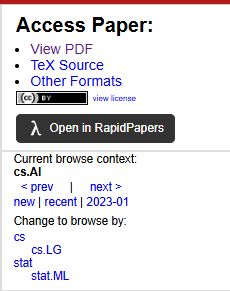

#  RapidLink for arXiv

> Chrome extension to navigate to a paper on [RapidPapers](https://www.rapidpapers.dev) from [arxiv.org](https://www.arxiv.org)

---

This extension inserts a RapidPapers button onto arxiv paper pages that are within the list of supported categories. That will then direct you to the RapidPapers page for that paper so you can add it to your library or find similar papers.

Don't know what RapidPapers is? Check it our [here!](https://www.rapidpapers.dev)

## Local installation guide

1. Clone this repo
2. Navigate to `chrome://extensions/` in Chrome
3. In the Extensions page, enable **Developer mode**
4. Click the **"Load unpacked"** button
5. Select the folder containing the RapidLink
6. The extension should now be loaded in Chrome!
